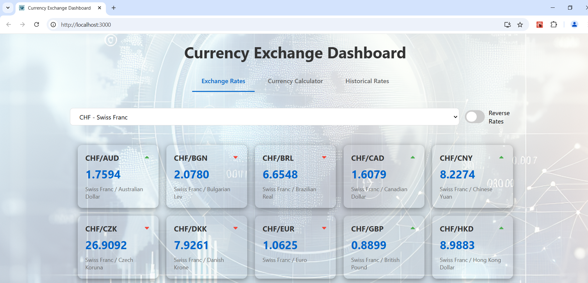

## Table of Contents

1. [Introduction](#introduction)
2. [Key Features](#key-features)
3. [Technologies Used](#technologies-used)
4. [Project Structure](#project-structure)
5. [Installation & Setup](#installation--setup)
6. [Usage & Screenshots](#usage--screenshots)

## Introduction

A full-stack web application providing currency exchange rates, historical data visualization, and currency calculator. Built with Django REST Framework and React.

## Key Features
- Currency Exchange Rates: Interactive dashboard displaying current rates with trend indicators
- Historical Data Visualization: Interactive charts showing rate trends over multiple time periods
- Currency Calculator: Instant currency conversion with swap functionality
- Responsive Design: Fully responsive interface adapting to all screen sizes

## Technologies Used

### Backend
- Django & Django REST Framework
- PostgreSQL Database

### Frontend
- React.js
- Recharts for data visualization
- Custom CSS for styling


## Project Structure
```
|-- backend/
|   |-- exchange/
|   |   |-- models.py         # Database models
|   |   |-- serializers.py    # API serializers
|   |   |-- views.py          # API endpoints
|   |   |-- urls.py           # API routing
|-- frontend/
    |-- src/
    |   |-- components/
    |   |   |-- CurrencyDashboard.js
    |   |   |-- CurrencyCalculator.js
    |   |   |-- HistoricalRates.js
    |   |-- App.js
|-- manage.py
```

## Installation & Setup

After fetching the files in repository or cloning the repository(`git clone (https://github.com/alper-sayin/Currency-Exchange-Dashboard.git)`) to desired folder, setting up virtual environment and satisfying the requirements([requirements.txt](backend/requirements.txt), [package.json](frontend/package.json)), open the terminal in your IDE, you should apply:

### Backend Setup
Run all commands in project root directory
-	`psql -U postgres`
-	`CREATE DATABASE test_currency_exchange;`
for database creation in your postgresql server

- Then	`python manage.py makemigrations`
-	`python manage.py migrate`
for database migrations.
-	`python manage.py load_historical_dates`
for seeding the database with currency exchange rates.
  After all that our backend is ready for launch
-	`python manage.py runserver`

### Frontend Setup
- Open another terminal in frontend directory
- `npm start` for running the server.
- Server automatically will be launched on http://localhost:3000 interacting with Django server(http://localhost:8000).
  
***Both servers should run simultaneously

### Docker Setup
For launching project without any dependencies above, Docker Desktop can be used.

In the project root directory, open the terminal;
`docker compose up`;for creating images and containers

-  `docker compose exec web python manage.py makemigrations exchange`
-  `docker compose exec web python manage.py migrate`
  for database migrations.
-`docker compose exec web python manage.py load_historical_dates`
for seeding the database with currency exchange rates.
Then; server can be accessed via http://localhost:3000

## Usage & Screenshots

Current currency exchange rates & trends according to previous rates


Reversing rates


Changing base currencies


Navigating to historical rates via clicking the particular currency exchange rate

10-year rates chart

5-year rates chart

1-year rates chart

1-week rates chart

Currency exchange calculator

Swapping currencies 


